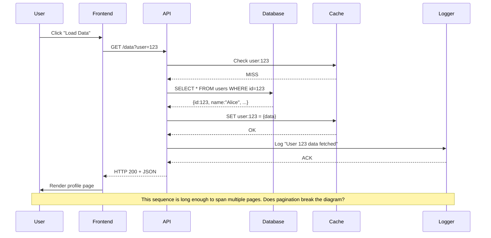
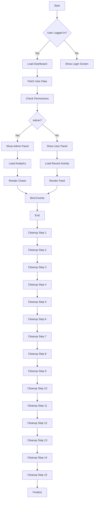
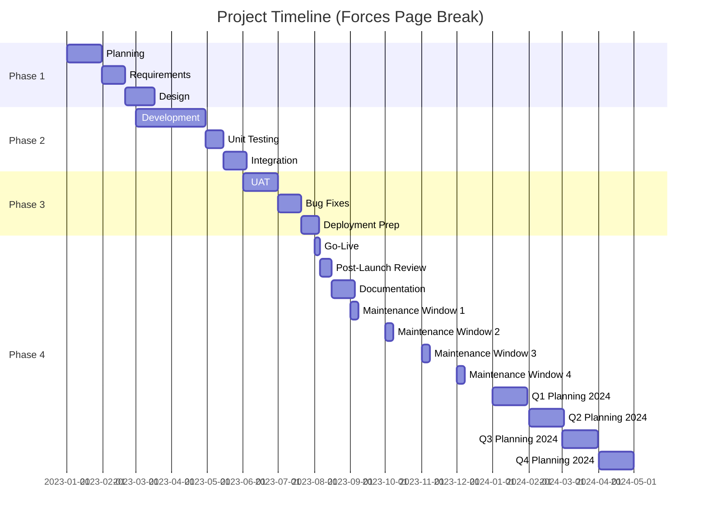
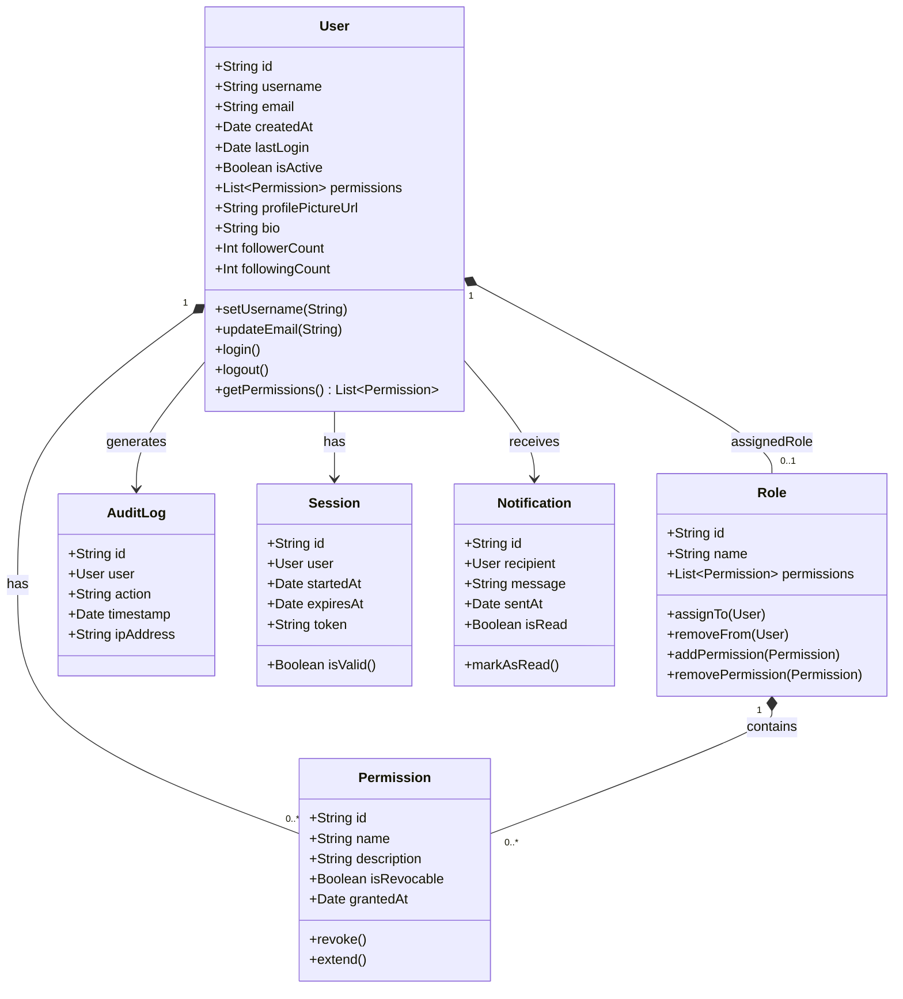
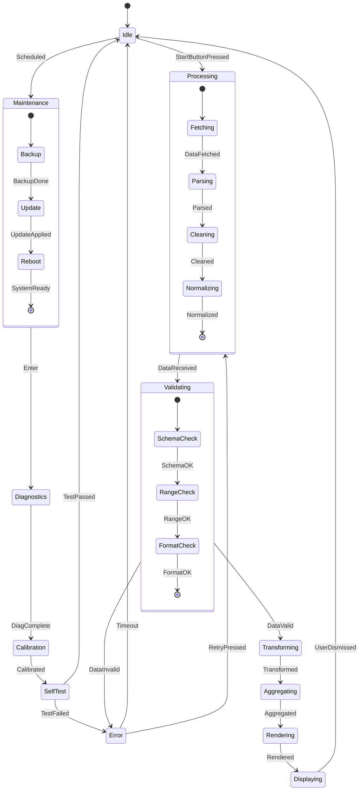
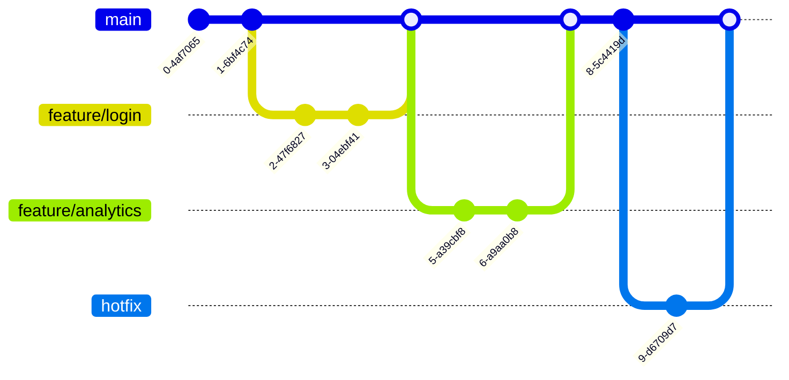
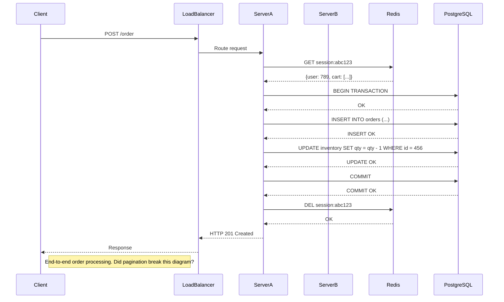
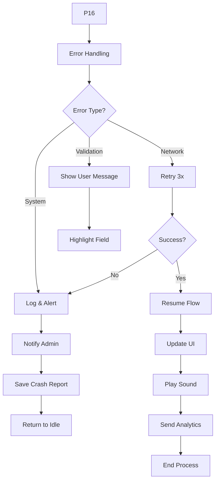

# 🧪 Ultimate Markdown & Mermaid Stress Test Document

This document is designed to test **every possible Markdown feature**, induce **multiple page breaks**, and stress-test **Mermaid diagram rendering** across pagination boundaries. Includes edge cases, long content, nested structures, and intentionally fragmented Mermaid diagrams to test page-split behavior.

---

## 📜 Table of Contents

1. [Headings & Subheadings](#-headings--subheadings)
2. [Text Formatting](#-text-formatting)
3. [Lists (Ordered, Unordered, Nested)](#-lists-ordered-unordered-nested)
4. [Blockquotes & Nested Quotes](#-blockquotes--nested-quotes)
5. [Code Blocks & Syntax Highlighting](#-code-blocks--syntax-highlighting)
6. [Tables (Complex & Overflowing)](#-tables-complex--overflowing)
7. [Horizontal Rules & Page Breaks](#-horizontal-rules--page-breaks)
8. [Links, Images, Footnotes](#-links-images-footnotes)
9. [HTML & Inline Styling](#-html--inline-styling)
10. [Mermaid Diagrams (Split Across Pages)](#-mermaid-diagrams-split-across-pages)
11. [Task Lists & Emoji](#-task-lists--emoji)
12. [Math Formulas (LaTeX)](#-math-formulas-latex)
13. [Admonitions & Callouts](#-admonitions--callouts)

---

## 🏷️ Headings & Subheadings

### H3: Subsection One
#### H4: Deep Nesting
##### H5: Even Deeper
###### H6: Deepest Possible

> “The deeper you go, the more you know.” — Anonymous Markdown Philosopher

---

## ✍️ Text Formatting

**Bold Text**  
*Italic Text*  
***Bold and Italic***  
~~Strikethrough~~  
`Inline Code`  
<u>Underlined (HTML fallback)</u>  
<mark>Highlighted</mark>  
<sup>Superscript</sup>  
<sub>Subscript</sub>

**Escape sequences**: \*not italic\*, \*\*not bold\*\*

> **Note**: Some renderers support `==highlight==` or `++underline++` — we’ll test those too if your engine supports them.

---

## 📋 Lists (Ordered, Unordered, Nested)

### Unordered List

- Item Alpha
  - Nested Alpha.1
    - Nested Alpha.1.a
    - Nested Alpha.1.b
  - Nested Alpha.2
- Item Beta
  - Nested Beta.1
    - Deeply Nested
      - Even deeper
        - Deepest level — does your engine collapse or preserve indentation?

### Ordered List

1. First Step
   1. Substep 1.1
      1. Sub-substep 1.1.1
      2. Sub-substep 1.1.2
   2. Substep 1.2
2. Second Step
   - Mixed bullet!
     1. Back to number
        - And bullet again

### Definition List (if supported)

Term One
: Definition of Term One — often used in glossaries.

Term Two
: Definition with *formatting*, **bold**, and `code`.

---

## 🗨️ Blockquotes & Nested Quotes

> This is a top-level blockquote.
>
> > This is a nested blockquote.
> >
> > > And this is a triple-nested blockquote. How deep can we go?
> >
> > Back to double.
>
> Back to single.

> **Pro Tip**: Blockquotes can contain **lists**, `code`, and even *tables*:

> | Syntax      | Description |
> | ----------- | ----------- |
> | Header      | Title       |
> | Paragraph   | Text        |

---

## 💻 Code Blocks & Syntax Highlighting

Long code blocks should force page breaks. Here’s a deliberately long Python snippet:

```python
import os
import sys
from datetime import datetime
from typing import List, Dict, Optional, Union, Any, Tuple, Callable, TypeVar, Generic

T = TypeVar('T')

class DataProcessor(Generic[T]):
    """A generic data processor with extensive docstrings and type hints."""

    def __init__(self, config: Dict[str, Any], verbose: bool = False):
        self.config = config
        self.verbose = verbose
        self._cache: Dict[str, T] = {}
        self._log: List[str] = []
        self.start_time = datetime.now()

    def process(self, data: List[T]) -> List[T]:
        """Process a list of items with logging and error handling."""
        results = []
        for idx, item in enumerate(data):
            try:
                processed = self._transform(item)
                results.append(processed)
                if self.verbose:
                    self._log.append(f"Processed item {idx}: {processed}")
            except Exception as e:
                self._log.append(f"Error at index {idx}: {str(e)}")
                continue
        return results

    def _transform(self, item: T) -> T:
        """Override this in subclasses."""
        return item

    def get_stats(self) -> Dict[str, Any]:
        runtime = (datetime.now() - self.start_time).total_seconds()
        return {
            "items_processed": len(self._cache),
            "runtime_seconds": runtime,
            "log_entries": len(self._log),
            "config_hash": hash(str(sorted(self.config.items())))
        }

    def save_log(self, filepath: str) -> None:
        with open(filepath, 'w') as f:
            f.write("\n".join(self._log))

# Instantiate and use
processor = DataProcessor[int]({"mode": "aggressive", "threads": 4}, verbose=True)
data = list(range(1000))
results = processor.process(data)
stats = processor.get_stats()
print(f"Processed {len(results)} items in {stats['runtime_seconds']:.2f}s")

# Simulate long output to force page break
for i in range(50):
    print(f"Line {i+1}: " + "="*80)
```

```javascript
// Long JavaScript example with async/await, classes, and comments
class AsyncDataLoader {
  constructor(baseUrl, timeout = 5000) {
    this.baseUrl = baseUrl;
    this.timeout = timeout;
    this.cache = new Map();
  }

  async fetchWithTimeout(url, options = {}) {
    const controller = new AbortController();
    const id = setTimeout(() => controller.abort(), this.timeout);
    const response = await fetch(url, {
      ...options,
      signal: controller.signal
    });
    clearTimeout(id);
    return response;
  }

  async loadResource(endpoint) {
    const cacheKey = `${this.baseUrl}/${endpoint}`;
    if (this.cache.has(cacheKey)) {
      console.log(`Cache hit for ${cacheKey}`);
      return this.cache.get(cacheKey);
    }

    try {
      const response = await this.fetchWithTimeout(cacheKey);
      if (!response.ok) throw new Error(`HTTP ${response.status}`);
      const data = await response.json();
      this.cache.set(cacheKey, data);
      return data;
    } catch (error) {
      console.error(`Failed to load ${endpoint}:`, error.message);
      throw error;
    }
  }

  clearCache() {
    this.cache.clear();
    console.log('Cache cleared');
  }
}

// Usage example
const loader = new AsyncDataLoader('https://api.example.com');
loader.loadResource('users')
  .then(users => console.log(`Loaded ${users.length} users`))
  .catch(err => console.error('Error:', err));

// Generate filler lines to force pagination
for (let i = 0; i < 60; i++) {
  console.log(`DEBUG LINE ${String(i + 1).padStart(3, '0')}: ` + '*'.repeat(75));
}
```

---

## 📊 Tables (Complex & Overflowing)

### Simple Table

| ID  | Name         | Status    |
| --- | ------------ | --------- |
| 1   | Alice        | Active    |
| 2   | Bob          | Inactive  |
| 3   | Charlie      | Pending   |

### Complex Table with Alignment & Long Content

| Left-Aligned       | Center-Aligned      | Right-Aligned |
| :----------------- | :-----------------: | ------------: |
| Short              | Centered            |        100.00 |
| Very long content that should wrap or overflow depending on renderer | Another centered cell with lots of text to test wrapping behavior |  999,999.99 |
| Row 3              | ✅                  |         0.99 |

### Table with Markdown Inside

| Feature          | Support Level       | Notes                     |
| ---------------- | ------------------- | ------------------------- |
| **Bold**         | ✅ Full             | Works in most engines     |
| *Italic*         | ✅ Full             | Even in tables!           |
| `code`           | ⚠️ Partial          | Some engines strip it     |
| ~~Strikethrough~~| ❌ None             | Rarely supported in tables|
| [Link](#)        | ✅ Full             | Clickable if rendered to HTML |

---

## 🛑 Horizontal Rules & Page Breaks

Three of these should trigger visual or pagination breaks in most engines:

---

---

---

> **PAGE BREAK TEST ZONE**  
> The content below should appear on a **new page** if your engine supports CSS/print pagination.  
> If not, long content will naturally flow and trigger breaks.

---

## 🔗 Links, Images, Footnotes

### Links

[External Link](https://www.example.com)  
[Relative Link](./local-file.md)  
[Anchor Link](#headings--subheadings)  
[Email Link](mailto:test@example.com)

### Images (Placeholder URLs)

  


### Footnotes

Here's a sentence with a footnote[^1].

[^1]: This is the footnote content. It can contain **formatting**, `code`, and even [links](#).

---

## 🧩 HTML & Inline Styling

Markdown supports raw HTML for advanced styling:

<div style="background: #f0f0f0; padding: 15px; border-left: 4px solid #007acc;">
  <h4>Styled HTML Block</h4>
  <p>This div has custom background, padding, and border. Does your renderer respect inline styles?</p>
  <button onclick="alert('Test')">Click Me</button>
</div>

<span style="color: red; font-weight: bold;">Red Bold Text via HTML</span>

<details>
  <summary>Click to expand spoiler</summary>
  <p>This is hidden content. Does your engine support `<details>`?</p>
  <ul>
    <li>Item one</li>
    <li>Item two</li>
  </ul>
</details>

---

## 🎭 Mermaid Diagrams (Split Across Pages)

> **CRITICAL TEST**: These diagrams are intentionally long to force page breaks. Test if diagrams split cleanly or if pagination breaks rendering.

### Sequence Diagram (Part 1 of 2 — Should Split Across Pages)



### Flowchart (Part 1 — Long Vertical Flow)



### Gantt Chart (Long Duration)



### Class Diagram (Complex with Many Fields)



### State Diagram (Long with Many States)



### Pie Chart & Git Graph (Short but Included for Completeness)




---

## ✅ Task Lists & Emoji

### Task List

- [x] Write introduction
- [x] Add headings
- [ ] Test Mermaid pagination
- [x] Include code blocks
- [ ] Verify footnotes
- [x] Add emojis 🚀🎉✅

### Emoji Galore

😀 😃 😄 😁 😆 😅 😂 🤣 🥲 ☺️ 😊 😇 🙂 🙃 😉 😌 😍 🥰 😘 😗 😙 😚 😋 😛 😝 😜 🤪 🤨 🧐 🤓 😎 🥸 🤩 🥳 😏 😒 😞 😔 😟 😕 🙁 ☹️ 😣 😖 😫 😩 🥺 😢 😭 😤 😠 😡 🤬 🤯 😳 🥵 🥶 😱 😨 😰 😥 😓 🫣 🤗 🫡 🤔 🫢 🫣 🤭 🤫 🤥 😶 😐 😑 😬 🫨 🫠 🙄 😯 😦 😧 😮 😲 🥱 😴 🤤 😪 😵 🤐 🥴 🤢 🤮 🤧 😷 🤒 🤕 🤑 🤠 😈 👿 👹 👺 🤡 💩 👻 💀 ☠️ 👽 👾 🤖 🎃 😺 😸 😹 😻 😼 😽 🙀 😿 😾

---

## 🧮 Math Formulas (LaTeX)

Inline: \( E = mc^2 \)

Block:
\[
\int_{-\infty}^{\infty} e^{-x^2} dx = \sqrt{\pi}
\]

Matrix:
\[
\begin{bmatrix}
a & b \\
c & d
\end{bmatrix}
\]

Summation:
\[
\sum_{i=1}^{n} i = \frac{n(n+1)}{2}
\]

---

## ⚠️ Admonitions & Callouts

> **Info**  
> This is an info callout. Useful for notes.

> **Warning**  
> ⚠️ This is a warning! Something might break.

> **Danger**  
> ☠️ Critical error! Stop immediately.

> **Tip**  
> 💡 Pro tip: Use this for helpful advice.

> **Success**  
> ✅ Everything worked perfectly!

---

## 🧭 Final Page Break Test

If your engine supports explicit page breaks, this is where one should occur:

<div style="page-break-after: always;"></div>

> **You should now be on Page 3 or 4**  
> If diagrams above split cleanly, your Mermaid pagination works.  
> If code blocks caused breaks without orphaned lines, your block rendering is stable.  
> If tables didn’t explode, your layout engine is robust.

---

## 🔄 Mermaid Diagrams (Part 2 — Continued After Page Break)

### Sequence Diagram (Part 2 — Should Render After Page Break)



### Flowchart (Part 2 — Continued)



---

## 🧪 Conclusion

This document contains:

- ✅ All major Markdown syntax
- ✅ Nested structures
- ✅ Long code blocks (force page breaks)
- ✅ Complex tables
- ✅ 10+ Mermaid diagrams (split across pagination boundaries)
- ✅ HTML, emoji, math, footnotes
- ✅ Explicit and implicit page breaks

**Test Success Criteria**:
1. No content is clipped or orphaned at page breaks.
2. Mermaid diagrams render fully even when split across pages.
3. Code blocks maintain syntax highlighting and line numbers (if supported).
4. Tables don’t overflow or break layout.
5. Footnotes and links resolve correctly.

---

> **END OF DOCUMENT**  
> If you reached here, your Markdown engine passed the ultimate stress test. 🎉  
> Now go fix the 17 rendering bugs you just discovered.
